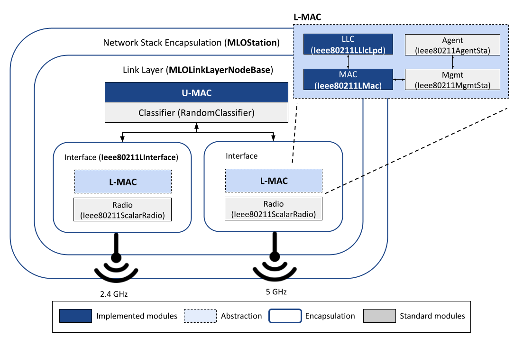
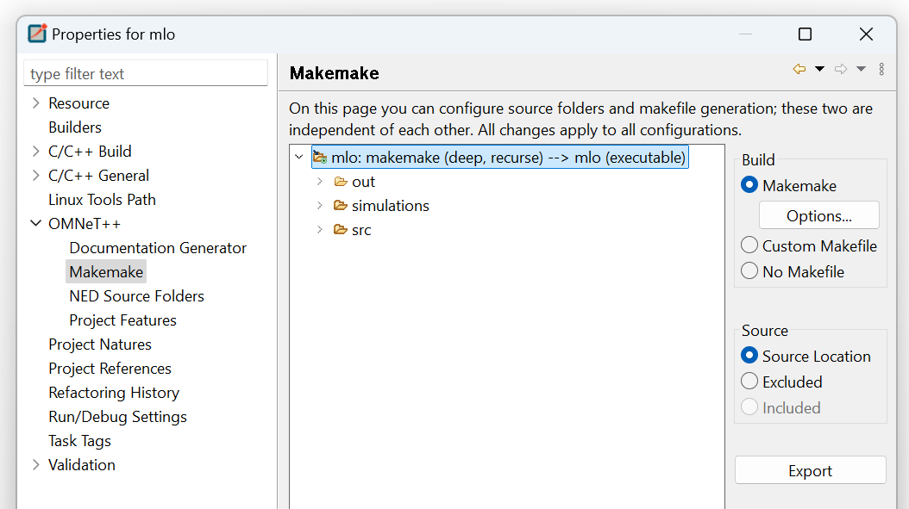

# Implementation of Wi-Fi 7 MLO in OMNeT++ #

This repo is the OMNeT++ project for MLO implementation. We use OMNeT++ v6.0.3 and INET v4.5.2. The MLO framework is mostly implemented on top of the existing 802.11 mechanisms in INET. 

## General Overview

`src` and `simulations` folders include the source code for implemented/extended modules, and example simulation setups and configurations, respectively. Here, we describe the main modules in the source files. The following project tree also shows an overview of these modules, excluding the files.

```
├───src
│    ├───common
│    ├───lmac
│    │   ├───llc
│    │   ├───mac
│    │   │   ├───channelaccess
│    │   │   ├───contention
│    │   │   └───coordinationfunction
│    │   └───portal
│    ├───umac
│    ├───protocolbase
│    └───node
└───simulations
```

### MLO Station and Access Point

Under `src/node`, you can find the implementation of MLO station (endpoint) and access point. They are encapsulation of several other modules as described in the respective *.ned* files. The figure below shows the implementation of the MLO station. For simplicity, the details beyond MAC layer implementation are excluded.

<p align="center"></p>

`MLOStation` follows a similar structure with the main OMNeT++ module `WirelessHost` that represents a generic implementation of TCP/IP stack over wireless interfaces. It simply encapsulates `MLOLinkLayerNodeBase` (under `src/protocolbase`), which is the main module encapsulating MLO-specific layers, e.g., U-MAC and multiple L-MAC instances. Therefore, you generally do not modify `MLOStation` but `MLOLinkLayerNodeBase` to extend 802.11 MAC layer with additional modules besides U-MAC and L-MAC.

`MLOAccessPoint` is a reimplementation of the OMNeT++ module `AccessPoint` with an additional U-MAC layer. Unlike the station, you can directly modify this to add new modules interplaying with MLO features, e.g., a packet scheduler, QoS classifier etc. Overall, it has the same MAC layer implementation with `MLOStation` and additional bridging modules existing in OMNeT++. Any modifications in U-MAC and L-MAC implementations would directly be observed in both station and access point as they share the same modules presented in the following sections.

### Wireless Interface and Lower MAC (L-MAC)

### Upper MAC (U-MAC)


## Installation Notes ##

1. Several Eclipse configuration files in the repo (*.nedfolders, .nedexclusions, .oppbuildspec*) represent the project settings that everyone needs to follow. Alternatively, you can check the correct settings on the following screenshot:

<p align="center"></p>

Additionally, `inet4.5` should be added to the project references.

2. You should manually add 802.11be as a supported protocol under Ethernet protocol group by modifying `Protocol.h` and `ProtocolGroup.h` (under `inet/common/`). Since the supported protocols are listed under constant static variables, there is not a straightforward way to add new ones without modifying several other OMNeT++ modules that include these source files. Therefore, the following modifications are required for now:
	- In `inet/common/Protocol.h`, add `static const Protocol ieee80211be;` as a new public variable under `Protocol` class.
	- In `inet/common/Protocol.cc`, define `const Protocol Protocol::ieee80211be("ieee80211be", "Wi-Fi 7", Protocol::LinkLayer);` as a constant variable. 
	- In `inet/common/ProtocolGroup.cc`, extend the static variable `static const ProtocolGroup::Protocols ethertypeProtocols` with `{ Protocol::ieee80211be.getId(), &Protocol::ieee80211be }`. 

